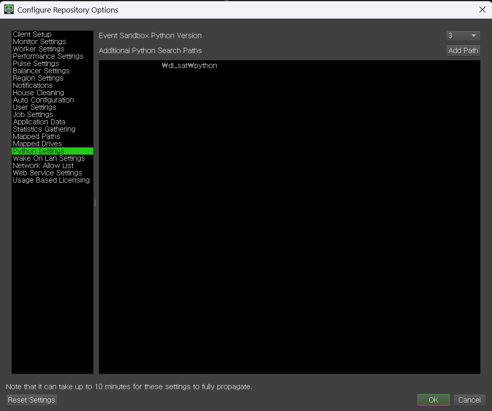

# 개요

[Substance Automation Took-kit](https://helpx.adobe.com/substance-3d-sat.html)의 데드라인 플러그인입니다.

# 구현 상황

## 구현 된 플러그인

- sbsrender

## 구현 예정 플러그인

- sbsbaker

## 예정 없음

- sbscooker : 데드라인 작업이 필요할 정도로 큰 작업이 아니라고 판단합니다.
- sbsmtools : 제가 SD 프로시주얼 매시 기능을 사용하지 않습니다.
- sbsmutator : 이걸로 .sbs 파일을 수정하느니 pysbs로 작업하는게 더 편합니다.
- sbsupdater: 데드라인 작업이 필요할 정도로 큰 작업이 아니라고 판단합니다.

# 설치 방법

1. [SAT](https://helpx.adobe.com/substance-3d-sat.html) 설치합니다.
2. [Deadline](https://aws.amazon.com/ko/thinkbox-deadline/) 설치합니다.
3. \$SAT_INSTALL_DIR/Python API/Pysbs-yyyy.x.y-py2.py3-none-win_amd64.whl 패키지를
   DEADLINE_INSTALL_DIR\bin\python3\python.exe에 설치합니다.
4. install.bat 파일을 메모장으로 엽니다.
5. 최상단 set "DEADLINE_DIR=C:\DeadlineRepository10"을 자신의 **데드라인 리포지토리 경로**로 수정합니다.
6. install.bat 파일을 관리자 권한으로 실행합니다.
7. 아래 이미지를 참고하여 python 패스를 추가합니다
   

8. 이후 사용법은 플러그인마다 별도의 문서를 참고 바랍니다.

- [sbsrender](plugins/sbsrender/README-kr.md)
