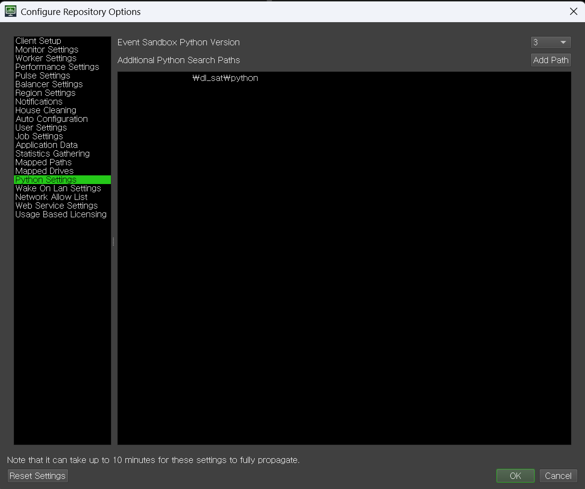

# Synopsis

Deadline plugin for [Substance Automation Took-kit](https://helpx.adobe.com/substance-3d-sat.html).

KR: [한국어](README-kr.md)

# Implementation status

## Implemented

- sbsrender

## Plan to be implemented

- sbsbaker

## No plan

- sbscooker: I determine that this is not a large enough task to require deadline processing.
- sbsmtools: I do not use SD's procedural mesh.
- sbsmutator: Using pysbs would be more convenient than modifying .sbs files with this tool.
- sbsupdater: I determine that this is not a large enough task to require deadline processing.

# Installation

1. Install [SAT](https://helpx.adobe.com/substance-3d-sat.html).
2. Install [Deadline](https://aws.amazon.com/ko/thinkbox-deadline/).
3. Install \$SAT_INSTALL_DIR/Python API/Pysbs-yyyy.x.y-py2.py3-none-win_amd64.whl package to Deadline python
   interpreter(DEADLINE_INSTALL_DIR\bin\python3\python.exe).
4. Open install.bat with any text editor.
5. Modify 'set "DEADLINE_DIR=C:\DeadlineRepository10"' line with your Deadline **Repository Path**.
6. Run install.bat file as administrator.
7. Add python path for Deadline as shown in the image below.
   
8. For usage, refer to the document for each plugin.

- [sbsrender](plugins/sbsrender/README.md)
