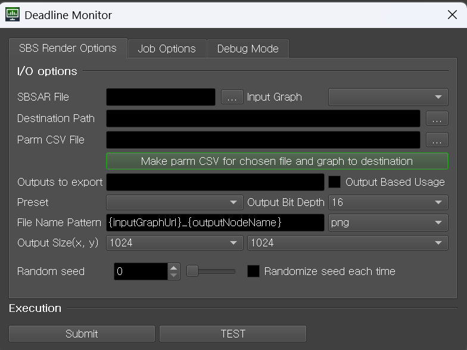

# 서브미터

## SBS Render Options

파일 생성에 필요한 파라미터를 입력합니다.

- **.SBSAR File**: 사용할 .sbsar 파일을 선택합니다.
- **Input Graph**: .sbsar 파일에 있는 그래프의 이름을 입력합니다. .SBSAR 파일 선택 시 콤보 박스 목록이 채워집니다.
- **Destination Path**: 출력 파일의 경로를 입력합니다.
- **Parm CSV File**: 그래프에 입력할 파라미터를 입력합니다. [CSV 파일 포맷](#CSV-파일-포맷) 을 참고하세요.
- **Make parm CSV for...**: 파라미터 입력용 CSV 파일을 Destination Path 위치에 생성합니다. 파일 이름은 \<sbsar 파일 이름>_\<그래프 이름>.csv 입니다.
- **Outputs to export**: 출력 이미지를 선택합니다.
- **Output Based Usage**: 체크 여부에 따라 출력 이미지 선택 방식을 변경합니다. 아래 File Name Pattern도 동시에 변경됩니다.
    - 체크: Output 노드의 usage로 출력 이미지 선택합니다. usage가 지정되지 않은 경우 무시합니다.
    - 체크 해제: Output 노드의 identifier로 출력 이미지 선택합니다.
- **Preset**: 프리셋이 지정된 경우 활성화 됩니다. 해당 그래프의 프리셋 중 하나를 선택할 수 있습니다.
- **Output Bit Depth**: 출력 이미지의 비트 깊이를 선택합니다.
- **File Name Pattern**: 출력 이미지 이름 패턴과 확장자를
  지정합니다. [참고](https://helpx.adobe.com/substance-3d-sat/command-line-tools/sbsrender/sbsrender-base-parameters-and-pattern-variables.html)
- **Output Size**: 출력 이미지의 크기를 지정합니다.
- **Random Seed**: 랜덤 시드 값을 지정합니다.
- **Randomize seed each Seed**: 각 시드별로 랜덤 시드를 무작위로 부여합니다.

# Job Options

미구현 상태입니다. 다른 플러그인과 동일한 포맷으로 제작될 예정이라 별도로 문서에 기술하지 않습니다.

# plugin_info.job 입력값

- 필수: 필수로 입력해야 하며, 입력하지 않으면 에러로 간주합니다.
- 선택: 입력하지 않아도 되며, 입력하지 않으면 기본값이 사용됩니다.
- SAT 입력값: Substance Automation Toolkit에서 사용하는 입력값입니다. 공식 문서에 있는 이름과 같은 이름을 사용하며, 별도로 명시되지 않은 경우 공식 문서에 있는 기본값을 사용합니다.
- 플러그인 입력값: 플러그인에서 사용하는 입력값입니다.

## 필수

### SAT 입력값

- input: 존재하는 .sbsar 파일 경로
- input-graph: .sbsar 파일에 있는 그래프의 이름
- output-path: 출력 파일 경로

### 플러그인 입력값

- csvFile : 그래프에 입력할 파라미터입니다. 그래프에서 사용하지 않는 파라미터는 무시합니다. 포맷은 하단의 [CSV 파일 포맷](#CSV-파일-포맷) 을 참고하세요.

## 선택

기본값이 있는 파라미터입니다.

### SAT 입력값

- output-bit-depth: 출력 이미지의 비트 깊이.
- output-format: 출력 이미지의 포맷.
- output-name: 출력 이미지의 이름 규칙
- outputsize: 출력 이미지의 크기. (가로),(세로) 형식으로 입력합니다. (기본값: 1024,1024)
- randomseed: 랜덤 시드 값. diffEachSeed == False 일 시 사용 (기본값: 0)

### 플러그인 입력값

- outputBasedUsage: 출력 이미지를 usage로 선택
- diffEachSeed: 각 시드별로 랜덤 시드를 무작위로 부여 (기본값: False)

# CSV 파일 포맷

- 1행: 파라미터 이름
- 2행: 파라미터 타입
- 3+행: 파라미터 값
- 각 열이 파라미터 하나에 대응됩니다.
- 파라미터 타입은 다음 중 하나입니다.
    - INTEGER1~4
    - FLOAT1~4
    - IMAGE
- 벡터 타입의 각 원소는 | 로 구분합니다.
- 빈 칸은 무시합니다
- boolean은 INTEGER1로 처리되며, 0은 False, 1은 True입니다.

## 예시

| x_amount | y_amount | size     | image1          |
|----------|----------|----------|-----------------|
| INTEGER1 | INTEGER1 | FLOAT2   | IMAGE           |
| 1        | 2        | 0.5\|0.7 | <path to image> |
|          | 10       |          | <path to image> |