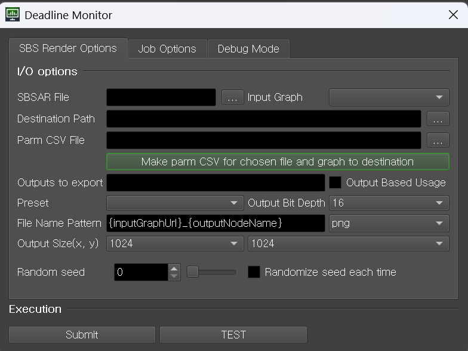

[KR](README-kr.md)

# Submitter

## SBS Render Options

Enter the parameters required for file generation.

- **.SBSAR File**: Select the .sbsar file to use.
- **Input Graph**: Enter the name of the graph in the .sbsar file. The combo box list is populated when selecting a
  .SBSAR file.
- **Destination Path**: Enter the path for the output files.
- **Parm CSV File**: Enter parameters to input into the graph. Refer to [CSV File Format](#CSV-File-Format).
- **Make parm CSV for...**: Creates a parameter input CSV file at the Destination Path location. The filename
  is \<sbsar filename>_\<graph name>.csv.
- **Outputs to export**: Select output images.
- **Output Based Usage**: Changes how output images are selected based on whether checked. The File Name Pattern below
  also changes simultaneously.
    - Checked: Select output images by Output node usage. If no usage is specified for the output node, it will be
      ignored.
    - Unchecked: Select output images by Output node identifier.
- **Preset**: Activated when a preset is specified. You can select one of the presets for chosen graph.
- **Output Bit Depth**: Select the bit depth of output images.
- **File Name Pattern**: Specify the output image name pattern and
  extension. [Reference](https://helpx.adobe.com/substance-3d-sat/command-line-tools/sbsrender/sbsrender-base-parameters-and-pattern-variables.html)
- **Output Size**: Specify the size of output images.
- **Random Seed**: Specify the random seed value.
- **Randomize seed each Seed**: Randomly assign random seeds for each task.

# Job Options

Not implemented yet, but will be same as other plugins. Will not be documented separately.

# plugin_info.job Input Values

- Required: Must be entered. Considered an error if not entered.
- Optional: Can be omitted. Default values are used if not entered.
- SAT Input Values: Input values used in Substance Automation Toolkit. Uses the same names and default value as in
  official documentation unless specified.
- Plugin Input Values: Input values used by the plugin.

## Required

### SAT Input Values

- input: Path to existing .sbsar file
- input-graph: Name of graph in .sbsar file
- output-path: Output file path

### Plugin Input Values

- csvFile: Parameters to input into the graph. Parameters not used in the graph are ignored. For format, refer
  to [CSV File Format](#CSV-File-Format) below.

## Optional

Parameters with default values.

### SAT Input Values

- output-bit-depth: Bit depth of output images.
- output-format: Format of output images.
- output-name: Naming convention for output images.
- outputsize: Size of output images. Enter in (width),(height) format. (Default: 1024,1024)
- randomseed: Random seed value. Used when diffEachSeed == False (Default: 0)

### Plugin Input Values

- outputBasedUsage: Select output images by usage
- diffEachSeed: Randomly assign random seeds for each seed (Default: False)

# CSV File Format

- Row 1: Parameter names
- Row 2: Parameter types
- Row 3+: Parameter values
- Each column corresponds to one parameter.
- Parameter types must be one of:
    - INTEGER1~4
    - FLOAT1~4
    - IMAGE
- Vector type elements are separated by |
- Empty cells are ignored
- Boolean is treated as INTEGER1, where 0 is False and 1 is True

## Example

| x_amount | y_amount | size     | image1          |
|----------|----------|----------|-----------------|
| INTEGER1 | INTEGER1 | FLOAT2   | IMAGE           |
| 1        | 2        | 0.5\|0.7 | <path to image> |
|          | 10       |          | <path to image> |